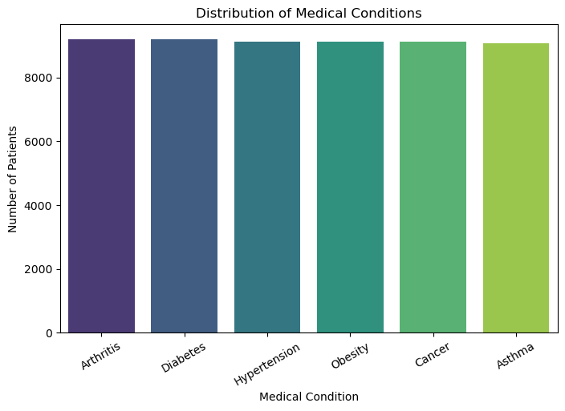
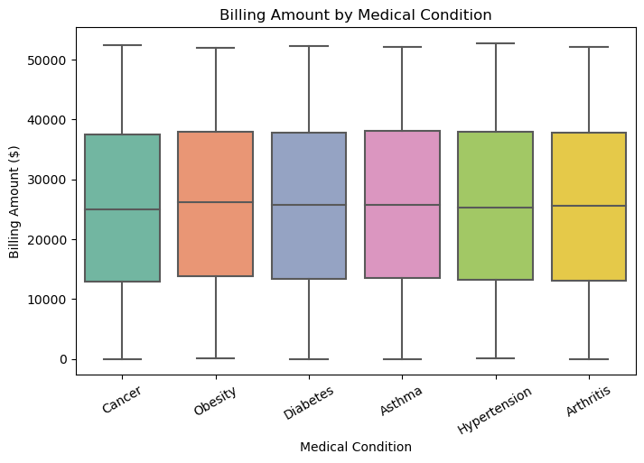
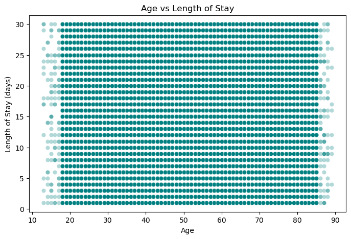
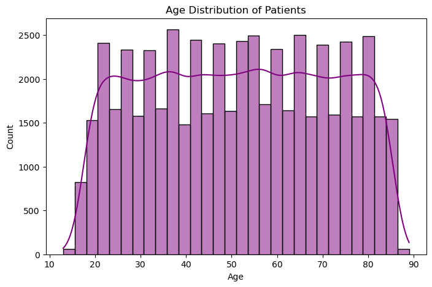

# Healthcare Data EDA — Patient Records Analysis

Exploratory Data Analysis on a hospital patient dataset (55,500 records) using Python, 
uncovering data quality issues and testing relationships between patient demographics, 
billing, and length of stay.

## Objective
Analyze hospital patient records to clean the data, engineer new features, and explore 
relationships between medical conditions, billing amounts, age, admission type, and 
length of hospital stay.

## Dataset
- Source: [Kaggle — Healthcare Dataset](https://www.kaggle.com/datasets/prasad22/healthcare-dataset)
- 55,500 rows, 15 columns including Age, Gender, Medical Condition, Billing Amount, 
  Admission Type, Date of Admission, Discharge Date

## Tools Used
- Python — Pandas, NumPy
- Matplotlib, Seaborn (data visualization)
- Jupyter Notebook

## Process
1. **Data Cleaning** — Removed 534 duplicate rows and 106 rows with invalid 
   (negative) billing amounts, resulting in a clean dataset of 54,860 records.
2. **Feature Engineering** — Created a new `Length of Stay` column by calculating 
   the difference between Discharge Date and Date of Admission.
3. **Exploratory Analysis** — Visualized and tested relationships between:
   - Medical Condition distribution
   - Billing Amount vs Medical Condition
   - Age vs Length of Stay
   - Admission Type vs Length of Stay
   - Overall Age distribution

## Key Insights
- Medical conditions are evenly distributed (~9,100 patients each across 6 conditions).
- Billing Amount shows **no significant variation** across medical conditions — median 
  billing stays around $25,000–26,000 regardless of diagnosis.
- **No correlation** found between Age and Length of Stay.
- Admission Type (Urgent, Emergency, Elective) does **not significantly affect** 
  Length of Stay.
- Age distribution is roughly uniform between 18–85, with sharp cutoffs at the 
  dataset's boundaries — a strong indicator the dataset is synthetically generated 
  rather than reflecting real-world clinical patterns.

## Visuals

### Medical Condition Distribution

### Billing Amount by Medical Condition

### Age vs Length of Stay

### Age Distribution

## Conclusion
This project demonstrates a complete EDA workflow — data cleaning, feature engineering, 
and multi-variable analysis using bar charts, boxplots, scatterplots, and histograms. 
While the dataset itself appears synthetically generated (shown by uniform distributions 
across all tested variables), the analysis reflects real-world EDA practices used to 
validate data quality and rule out relationships between variables before drawing 
conclusions.

## Files
- `healthcare_eda.ipynb` — Full analysis notebook with code, outputs, and visuals
- `healthcare_dataset.csv` — Raw dataset
- `images/` — Exported chart visuals
